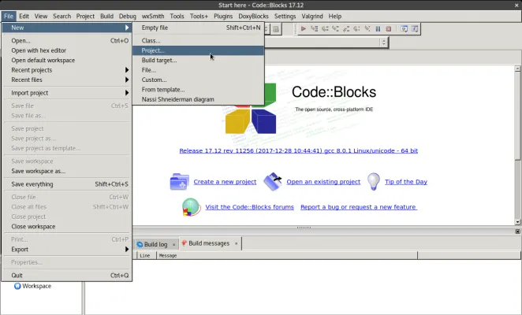
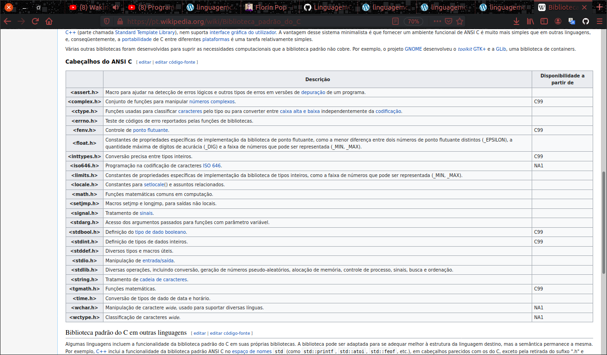

<h1>Criando um programa em linguagem C</h1>

1) Abra o code blocks e depois clique no menu <strong>File | New | Source File</strong>



2) Na janela, digite a estrutura básica da linguagem C: 

```
  /* Os comentários podem ser colocados em qualquer parte do programa */

#inclusão dos arquivos de bibliotecas

int main(void)
{
        declaração de variáveis locais
        ...
        comandos;
        ...
}
```
# Biblioteca de entrada

__#include <stdio.h>__

- Responsável pelo tratamento de entrada / saida.

__#include <string.h>__

- Responsável pelo tratamento de strings.

__#include <stdlib.h>__

- Implementa funções para diversas operações, incluindo conversão, alocação de memória, controle de processo, funções de busca e ordenação.

# Tabela de Biblioteca na linguagem C  



## A função __printf()__

O comando é usado para exibir valores na tela é a função __printf()__.

## Sintaxe básica: 

__printf("Mensagem a ser escrita na tela");__

Também é possível mostrar texto e valores de variáveis usando argumentos.

## Sintaxe: 

printf(" Mensagem a ser escrita na tela",  lista de arguementos);

__Exemplo de mensagem que inclui o valor de uma variável:__
print("Total a pagar: R$ %f", total);

onde: 
- __%f__ -> Representa o local onde será escrita uma variável float

- O total é a variável float que será mostrada na posição marcada por __%f__.

